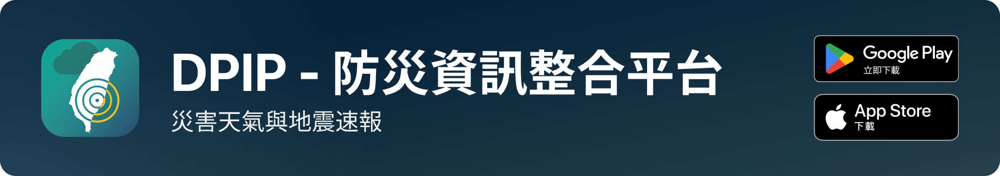

<div align="center">

[](#下載)

**臺灣的防災資訊整合平台 —— 地震速報、即時震度、天氣與災害示警，都在同一個 App 裡。**

[](https://github.com/ExpTechTW/DPIP/releases/latest)
[](https://github.com/ExpTechTW/DPIP/releases)
[](https://github.com/ExpTechTW/DPIP/actions/workflows/ci.yml)
[](https://crowdin.com/project/dpip)
[](https://discord.gg/5dbHqV8ees)

[官網](https://exptech.dev) • [更新日誌](https://github.com/ExpTechTW/DPIP/releases) • [開發文件](AGENTS.md)

<a href="https://play.google.com/store/apps/details?id=com.exptech.dpip"></a>
<a href="https://apps.apple.com/tw/app/dpip-%E7%81%BD%E5%AE%B3%E5%A4%A9%E6%B0%A3%E8%88%87%E5%9C%B0%E9%9C%87%E9%80%9F%E5%A0%B1/id6468026362"></a>

</div>

## DPIP 是什麼

DPIP（Disaster Prevention Information Platform）是臺灣本土團隊開發的行動應用程式，整合強震即時警報、地震資訊、天氣與各類災害示警。

地震發生時，地震波從震央傳到你所在的位置需要數秒到數十秒。強震即時警報就是在這段時間差裡送出通知 —— 讓你在搖晃抵達之前，還有時間趴下、掩護、穩住。

## 能做什麼

| | |
|---|---|
| **地震速報** | 地震發生時推播你所在地的預估震度，以及距離搖晃還有幾秒 |
| **即時震度** | 地圖上即時顯示 TREM-Net 各觀測站的實測震度 |
| **地震報告** | 查詢歷史地震的震度分布、規模與深度 |
| **天氣與雨量** | 你所在鄉鎮的天氣、雨量趨勢與雷達回波 |
| **颱風** | 路徑預報、暴風圈範圍與警戒資訊 |
| **災害示警** | 中央氣象署與國家災害防救科技中心的各類示警，疊在同一張地圖上 |
| **多語言** | 介面支援 10 種語言 |

> [!NOTE]
> 這個儲存庫正在進行架構重寫（feature-first 分層，見 [ARCHITECTURE.md](ARCHITECTURE.md)）。`main` 上的每一次提交都會發布一個快照版本，快照未經完整審查。想要穩定版本請從商店安裝。

## 資料來源

### 地震

| 資料 | 來源 |
|---|---|
| 強震即時警報 | [交通部中央氣象署](https://www.cwa.gov.tw/)（CWA） |
| 緊急地震速報（可選） | [日本氣象廳](https://www.jma.go.jp/)（JMA、気象庁） |
| 地震報告 | 交通部中央氣象署 |
| 即時震度 | TREM-Net |

### 氣象

| 資料 | 來源 |
|---|---|
| 天氣、雨量、閃電 | 交通部中央氣象署 |
| 颱風路徑、暴風圈、警報 | 交通部中央氣象署 |
| 雷達回波 | 交通部中央氣象署 |
| 未來一小時降水（QPESUMS） | 交通部中央氣象署 |
| 衛星雲圖 | [日本氣象廳](https://www.jma.go.jp/)向日葵 8／9 號（Himawari），16 個觀測波段 |

### 防災

| 資料 | 來源 |
|---|---|
| 各類災害示警 | [國家災害防救科技中心](https://www.ncdr.nat.gov.tw/)（NCDR） |
| 避難收容處所、AED、公廁 | 政府開放資料 |

### 關於 TREM-Net

TREM-Net 由 [ExpTech Studio](https://exptech.dev/) 建置與維運，自 2022 年 6 月起在全臺部署，由兩個子系統組成：**SE-Net**（強震觀測網，加速度儀）與 **MS-Net**（微震觀測網，速度儀），共同記錄地震發生時的完整波形。

## 下載

從商店安裝（建議）：

- [Google Play](https://play.google.com/store/apps/details?id=com.exptech.dpip)
- [App Store](https://apps.apple.com/tw/app/dpip-%E7%81%BD%E5%AE%B3%E5%A4%A9%E6%B0%A3%E8%88%87%E5%9C%B0%E9%9C%87%E9%80%9F%E5%A0%B1/id6468026362)

也可以從 [Release 頁面](https://github.com/ExpTechTW/DPIP/releases/latest)取得 Android 安裝檔手動安裝。請注意 Release 頁面同時包含快照版本，那些未經完整審查。

想搶先體驗新功能？加入**測試版**：

- [Android 測試版](https://play.google.com/apps/testing/com.exptech.dpip) —— 開啟 Google Play 的測試版申請頁
- [iOS 測試版（TestFlight）](https://testflight.apple.com/join/8aPWtOxk) —— 需要在 iPhone、iPad 或 Mac 上先安裝 TestFlight

測試版可能包含尚未完整審查的功能，遇到問題歡迎到 [Issues](https://github.com/ExpTechTW/DPIP/issues) 回報。

## 翻譯

DPIP 介面目前有 10 種語言，翻譯在 [Crowdin](https://crowdin.com/project/dpip) 上進行，挑一個你熟悉的語言就能開始。

清單裡沒有你的語言，就到 [Issues](https://github.com/ExpTechTW/DPIP/issues) 開一則，我們會加上去。

## 參與開發

工具鏈由 [mise](https://mise.jdx.dev/) 釘選版本：

```bash
git clone https://github.com/ExpTechTW/DPIP.git
cd DPIP
mise install          # 安裝 mise.toml 釘選的 Flutter
tool/dev/deps.sh      # 取得套件
```

git hooks 由 `tool/run.sh` 第一次啟動時自動裝好，不用另外做。只想建置不想跑的話，`tool/dev/setup.sh` 可以單獨裝。

啟動：

| 系統 | 指令 |
|---|---|
| macOS、Linux | `tool/run.sh -d <裝置>` |
| Windows | `tool\run.ps1 -d <裝置>`（或用 Git Bash／WSL 跑 `bash tool/run.sh`，日誌會上色） |

**一定要用這個腳本。** debug 版本偵測到不是這樣啟動會拒絕執行並印出正確指令 —— 直接跑起來的話，用到的是你 shell 快取的那個 Flutter 而不是 `mise.toml` 釘選的那個，而且當下不會有任何徵兆。

建置成安裝檔：

```bash
tool/dev/build.sh android    # APK
tool/dev/build.sh bundle     # AAB（Play 實際收的格式）
tool/dev/build.sh ios        # iOS（不含簽章）
```

其餘每件事也都有腳本，`tool/` 底下分類放好：

| 要做什麼 | 指令 |
|---|---|
| 跑測試 | `tool/dev/test.sh` |
| 格式化 + 靜態分析 | `tool/dev/analyze.sh` |
| 只格式化 | `tool/dev/format.sh` |
| 重新產生 l10n | `tool/dev/l10n.sh` |
| 重新產生 codegen | `tool/dev/codegen.sh` |
| 砍掉重建 | `tool/dev/clean.sh` |
| 跑完 CI 會跑的每一道關卡 | `tool/check.sh` |

**mise 是必要條件，不是建議。** 沒有 mise 就不能建置這個專案 —— 腳本會直接拒絕執行並告訴你怎麼裝。

**絕對不要自己打 `flutter`、`dart` 或 `mise exec`。** 工具鏈只在 `tool/dev/_lib.sh` 一個地方指定。理由不是整潔：shell 的 PATH 只解析一次，`mise activate` 會把它快取起來，所以升級工具鏈之後舊的 SDK 還留在 PATH 上 —— 而**用錯 SDK 一樣建得起來、跑得起來、測試也會過**，差別要到幾天後變成一個沒人重現得出來的失敗才浮現。

三道防線：

| 誰 | 擋什麼 |
|---|---|
| `tool/dev/_lib.sh` 的 `require_mise` | 沒裝 mise、沒有 `mise.toml`、或 flutter 解析到 mise 以外的路徑，一律拒絕執行 |
| `tool/check/tooling.sh` | 文件與 CI 裡出現裸指令；`tool/` 裡任何腳本語法錯、沒有執行權限、或直接呼叫 `flutter` / `dart` / `mise exec` |
| `tool/run.sh` | 啟動前把上面兩項都跑一次（0.34 秒） |

> [!NOTE]
> Android 需要 JDK 17 以上（Android Studio 內建的即可）。iOS 已改用 Swift Package Manager，不需要 CocoaPods。

**其餘所有事情都寫在別的地方，這裡不重複** —— 重複的文件一定會走鐘：

| 想找 | 看 |
|---|---|
| 工具鏈、執行、推送前的驗證清單、版本規則 | [AGENTS.md](AGENTS.md) |
| 資料夾結構、分層規則、各子系統的契約 | [ARCHITECTURE.md](ARCHITECTURE.md) |
| 設計 token、顏色、間距、動態、圖示、多語言 | [DESIGN.md](DESIGN.md) |
| API 端點與區域對照 | [api.md](api.md) |
| Commit 格式（CI 會擋） | [commit.md](commit.md) |

## 參與方式

- 回報問題或提出建議：[Issues](https://github.com/ExpTechTW/DPIP/issues)
- 提交程式碼：[Fork](https://github.com/ExpTechTW/DPIP/fork) 這個儲存庫，開新分支修改，然後送 [Pull Request](https://github.com/ExpTechTW/DPIP/pulls)
- 改進文件：上面那五份都歡迎

送 PR 之前請先讀 [commit.md](commit.md)：commit 訊息會直接變成更新日誌，格式不合 CI 會擋下來。

感謝所有讓 DPIP 成為可能的貢獻者：

[](https://github.com/exptechtw/DPIP/graphs/contributors)

## 合作夥伴

| | |
|---|---|
| [](https://www.geoscience.com.tw/) | [巨科資訊有限公司](https://www.geoscience.com.tw/) 提供開發與測試所需的設備 |
| [](https://www.twds.com.tw/) | [台灣數位串流有限公司](https://www.twds.com.tw/) 提供雲端運算資源、網路頻寬與技術諮詢 |

## 授權

[DPIP Public License](LICENSE)。**這是 source-available 授權，不是開放原始碼授權** —— 原始碼公開可閱讀、可貢獻，但禁止商業使用，也禁止用來做出與 DPIP 競爭的產品。完整條款見 [LICENSE](LICENSE)。

## Star History

<a href="https://www.star-history.com/?type=date&repos=exptechtw%2Fdpip">
 <picture>
   <source media="(prefers-color-scheme: dark)" srcset="https://api.star-history.com/chart?repos=exptechtw/dpip&type=date&theme=dark&legend=top-left&sealed_token=W5nrby1cW41C6wO-pyTS03g09KIf7gK4LQILagMeXzRWFPhswq_OAHgFdq_mKh-QcVxUvdyYzc-IcWOEL3m-QhUH49bzP85hsXEwi6x5YRj6R8QeRcndYw" />
   <source media="(prefers-color-scheme: light)" srcset="https://api.star-history.com/chart?repos=exptechtw/dpip&type=date&legend=top-left&sealed_token=W5nrby1cW41C6wO-pyTS03g09KIf7gK4LQILagMeXzRWFPhswq_OAHgFdq_mKh-QcVxUvdyYzc-IcWOEL3m-QhUH49bzP85hsXEwi6x5YRj6R8QeRcndYw" />
   
 </picture>
</a>
